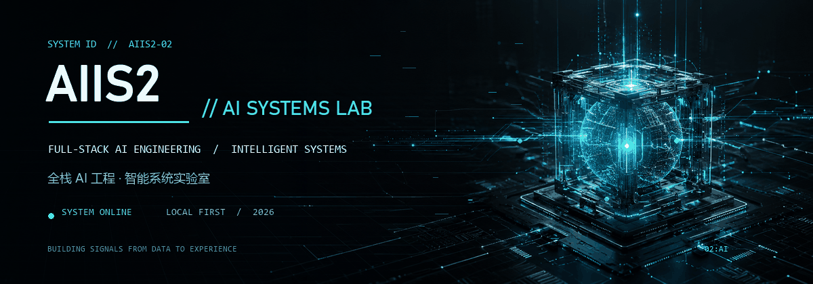

<div align="center">
  
  <br><br>
  <strong>Full-stack AI engineer building intelligent systems from data to experience.</strong>
  <br>
  <sub>全栈 AI 工程师，构建从数据、智能体到交互体验的完整智能系统。</sub>
</div>

<br>

## `SYSTEM PROFILE`

**AIIS2 // AI SYSTEMS LAB** is an independent engineering lab focused on turning reasoning models into dependable products. I work across agent orchestration, local-first data systems, desktop and web engineering, and the interaction layer where AI becomes genuinely useful.

**AIIS2 // AI SYSTEMS LAB** 是一个专注于智能系统的独立工程实验室。我关注的不只是模型能力，更是如何把智能体编排、本地数据系统、桌面与 Web 工程，以及最终交互体验组合成可靠、可用的产品。

> Build the system, not just the demo.  
> 不只完成演示，更要构建真正可运行的系统。

## `CURRENT SIGNALS`

```text
01  AGENTIC ANALYTICS       // 智能体驱动的数据分析
02  LOCAL-FIRST SYSTEMS     // 本地优先与隐私友好的 AI 产品
03  MULTI-AGENT RUNTIMES    // 多智能体协作与工具编排
04  INTERACTIVE REPORTING   // 从数据到交互式报告
05  HUMAN-CENTERED AI UX    // 以人为中心的 AI 交互体验
```

## `PROJECT MATRIX`

### `01 / DATELL`

**A polished local-first AI analyst for interactive reporting.**  
本地优先的 AI 数据分析工作台：连接文件与数据库，通过 ReAct 智能体完成分析、验证，并输出可交互、可导出的专业报告。

`ReAct Agents` · `Electron` · `React` · `TypeScript` · `DuckDB` · `Local RAG`

[Open Datell](https://github.com/aiis2/datell)

---

### `02 / RISK AGENT`

**A local-first coordinator/worker workspace for risk intelligence.**  
面向业务风险场景的本地分析系统，结合 Coordinator + Worker 智能体循环、结构化规则、知识与血缘视图，以及浏览器和 MCP 工具层。

`Agent Orchestration` · `Fastify` · `WebSocket` · `React` · `Electron` · `SQLite`

[Open Risk Agent](https://github.com/aiis2/risk-agent)

---

### `03 / FRONTEND DESIGN REPORT`

**An installable Agent Skill and visual-report MCP runtime.**  
面向 Datell 风格视觉报告生成的 Agent Skill 与 MCP 运行时，包含布局、配色、卡片目录和经过验证的静态报告回退能力。

`Agent Skills` · `MCP` · `HTML` · `Visual Systems` · `Report Runtime`

[Open Frontend Design Report](https://github.com/aiis2/frontend-design-report)

## `TECH STACK`

<p>
  
  
  
  
  
  
</p>

<p>
  
  
  
  
  
  
</p>

## `OPEN CHANNEL`

I build systems where AI can reason, act, verify, and present its work clearly. Follow the repositories to watch those experiments become usable products.

我持续探索 AI 如何进行推理、行动与验证，并把结果清晰地呈现给人。所有公开实验与产品进展都会沉淀在这里。

<div align="center">
  <a href="https://github.com/aiis2">
    
  </a>
</div>
